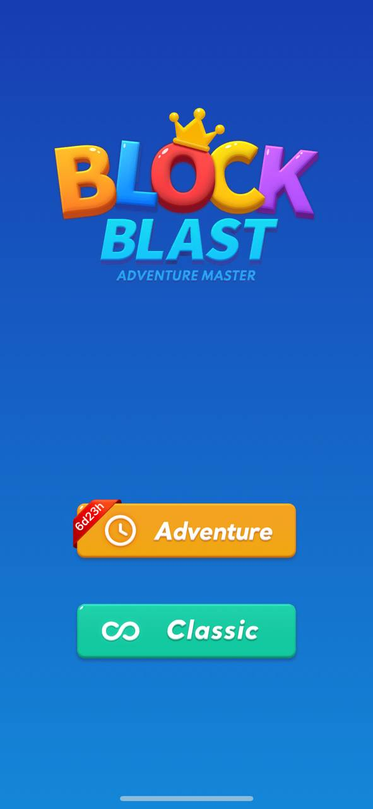
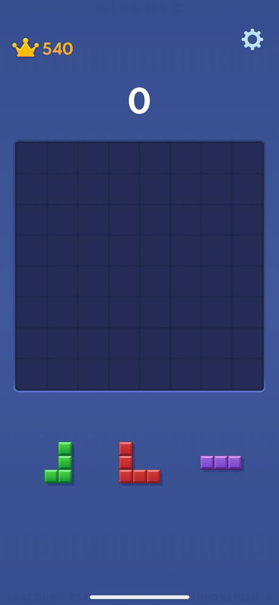
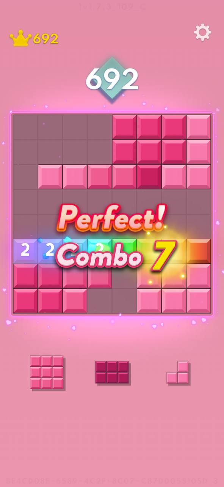
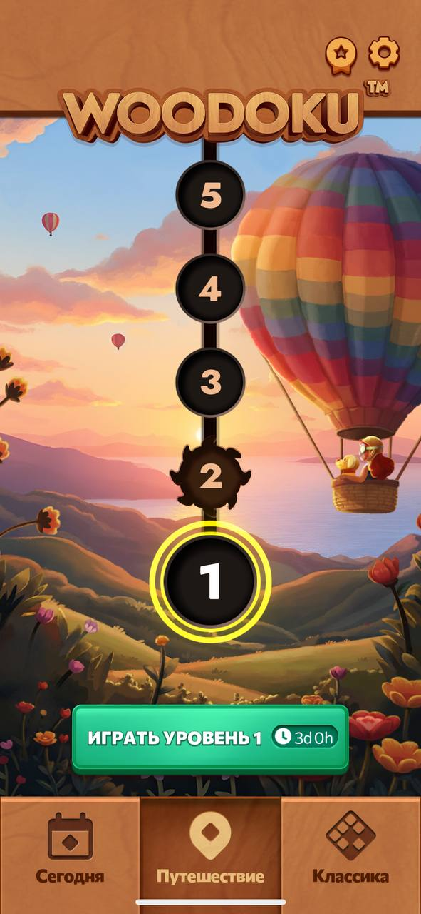
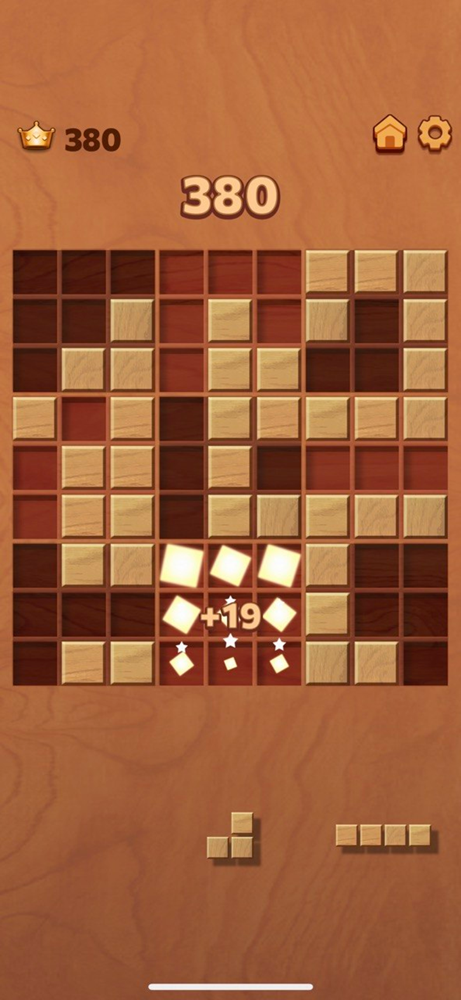
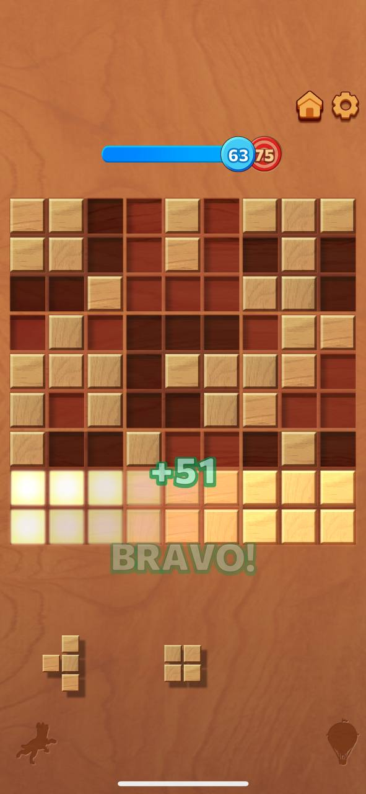
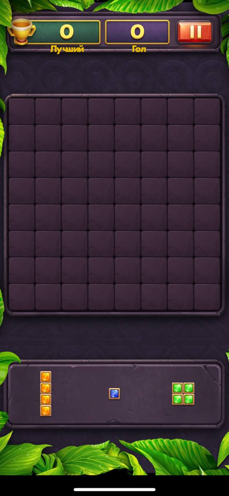
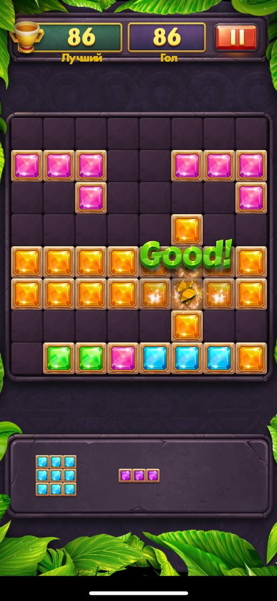
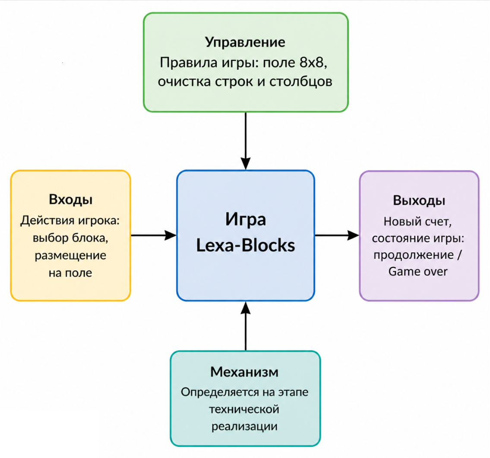
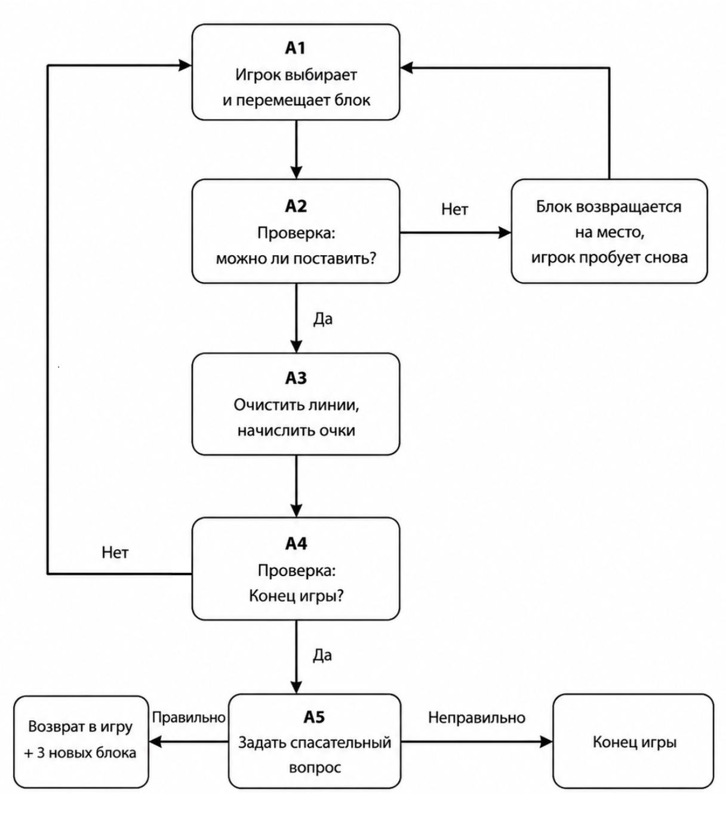

# Lexa-Blocks — аналитическая часть проекта

**Версия:** 3.0  
**Дата:** 20.05.2026  
**Ответственный:** [zrqze](https://github.com/zrqze)  

> **Цель документа:** обосновать актуальность игры, выбрать метод анализа (SADT), зафиксировать требования.

---

## 1. Анализ рынка похожих игр

### 1.1. Block Blast

  
  
  

**Что хорошо:**
- Простая и понятная механика
- Плавная анимация
- Личные рекорды с множителями очков
- Выбор режимов (Adventure / Classic)
- Эмоциональная похвала («Perfect!», «Best Score!»)

**Что плохо:**
- При тупике продолжить можно **только через рекламу**
- Геймплей со временем становится однотипным
- **Нет образовательного элемента**

---

### 1.2. Woodoku

  
  
  

**Что хорошо:**
- Три способа очистки (строки, столбцы, квадраты 3×3)
- Чёткая прогрессия по уровням с визуализацией (63/75)
- Ежедневные задания и режимы («Сегодня», «Путешествие», «Классика»)
- Эмоциональная похвала («BRAVO!», «ПОЛУЧИЛОСЬ!»)
- Сбор кристаллов — дополнительная мотивация

**Что плохо:**
- Реклама между уровнями или сразу после проигрыша
- **Нет образовательного элемента**

---

### 1.3. Block Puzzle Jewel

  
  

**Что хорошо:**
- Яркие комбо-эффекты
- Хорошо подходит для коротких игровых сессий

**Что плохо:**
- Перегруженный визуал
- Быстро надоедает
- **Нет образовательного элемента**

---

### 1.4. Обобщённый вывод по анализу аналогов

| Критерий | Block Blast | Woodoku | Block Puzzle Jewel |
|----------|-------------|---------|-------------------|
| Спасение при тупике | Реклама | Реклама | Реклама |
| Образовательный элемент | Нет | Нет | Нет |
| Реклама | Есть | Есть | Есть |
| Разнообразие геймплея | Среднее | Высокое | Низкое |

**Ключевая проблема всех аналогов:** игрок в тупике либо смотрит рекламу, либо проигрывает. Образовательной или развивающей составляющей нет.

---

## 2. Чем Lexa-Blocks будет актуальнее

| Критерий | Аналоги | Lexa-Blocks |
|----------|--------|-------------|
| Спасение при тупике | Только через рекламу | **Через ответ на вопрос** (бесплатно) |
| Реклама | Есть (между уровнями / за бонусы) | **Отсутствует полностью** |
| Образовательный элемент | Нет | **Математические вопросы** (генерация через внешний API) |
| Разнообразие игрового опыта | Однотипный геймплей | **Динамическая генерация вопросов** → каждая игра разная |
| Прогресс игрока | Только очки / уровни | **Шкала прогресса до 100 очков + уровень** |

---

## 3. Анализ методом SADT (IDEF0)

**Почему выбран SADT?**  
Процессы в игре чётко разделяются на последовательные шаги:  
`Действие игрока → Проверка → Результат`.  
Метод IDEF0 позволяет наглядно представить функциональную структуру.

---

### 3.1. Контекстная диаграмма (A-0)

  

**Управление:** Правила игры (поле 8×8, очистка строк и столбцов)  
**Вход:** Действия игрока (выбор блока, размещение на поле)  
**Выход:** Новый счёт, состояние игры (продолжение / Game Over)  
**Механизм:** Игровой движок (определяется на этапе технической реализации)

---

### 3.2. Декомпозиция — основные процессы игры

| № | Процесс | Что входит | Что получается |
|---|---------|------------|----------------|
| A1 | Выбрать и переместить блок | Действие игрока | Блок на новой позиции |
| A2 | Проверить возможность размещения | Координаты блока на сетке | Да / Нет |
| A3 | Очистить заполненные линии | Заполненная строка или столбец | Новые очки |
| A4 | Проверить состояние Game Over | Есть ли возможные ходы у всех блоков | Game Over или продолжение |
| **A5** | **Задать вопрос (спасение)** | Игрок нажал кнопку «Ответить на вопрос» | **Текст вопроса и варианты ответов** |

---

### 3.3. Декомпозиция — схема процессов (A0)

  

*Основные процессы игры A1–A5 и их связи.*

**Описание связей:**
- A1 → A2: блок перемещён, нужно проверить возможность размещения
- A2 → A3 (если Да): размещение возможно → очистить линии
- A2 → A1 (если Нет): блок возвращается, игрок пробует снова
- A3 → A4: после очистки линий проверить, не тупик ли
- A4 → A1 (если продолжение): игра продолжается
- A4 → A5 (если Game Over): тупик → предложить спасение через вопрос

**Ключевое решение:** Процесс **A5** — это главная инновация Lexa-Blocks. В аналогах на этом месте реклама, в нашей игре — образовательный элемент.

---

## 4. Выводы

### 4.1. Обоснование актуальности

Проведённый анализ показал, что игры-аналоги имеют сильные механики (прогрессия, эмоциональная похвала, комбо-эффекты), но их ключевые недостатки — **навязчивая реклама** и **полное отсутствие образовательной составляющей**.

Lexa-Blocks устраняет эти недостатки:
- Спасение при тупике происходит не за просмотр рекламы, а через ответ на математический вопрос
- Реклама отсутствует полностью — игрок не отвлекается от процесса
- Образовательный элемент делает игру не просто развлечением, но и полезной тренировкой
- Динамическая генерация вопросов обеспечивает высокую вариативность

### 4.2. Результаты SADT-анализа

Метод SADT (IDEF0) позволил:
1. Наглядно представить процессы игры (A1–A5)
2. Выделить главную инновацию — процесс **A5** (спасение через вопрос)
3. Чётко определить интерфейсы между процессами

### 4.3. Итог

Lexa-Blocks — это актуальная альтернатива классическим блок-головоломкам, объединяющая:
- Простоту жанра (поле 8×8, очистка линий)
- Образовательный элемент (математические вопросы через API)
- Отсутствие рекламы (спасение за знания, а не за просмотр)
