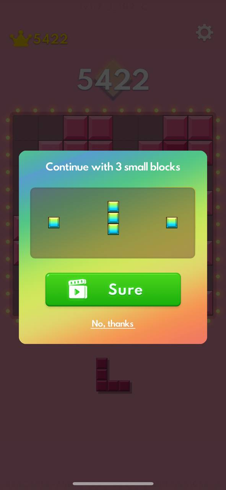
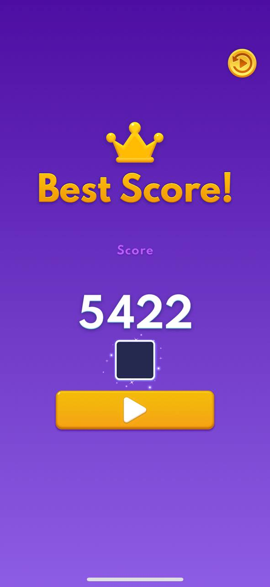
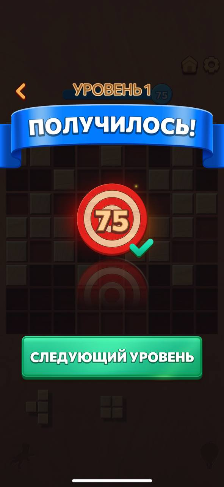
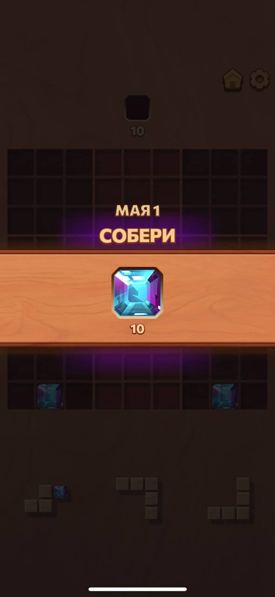

# Lexa-Blocks — аналитическая часть проекта

**Цель документа:** обосновать актуальность игры, выбрать метод анализа (SADT), зафиксировать требования.
**Ответственный аналитик:** [zrqze](https://github.com/zrqze)
**Версия:** 3.0 (20.05.2026)

---

## 1. Анализ рынка похожих игр

### 1.1. Block Blast

  
  
  
  
  

**Что хорошо:**  
- Простая механика, плавная анимация  
- Личные рекорды с множителями очков  
- Выбор режимов (Adventure / Classic)  
- Эмоциональная похвала («Perfect!», «Best Score!»)  
- Можно включить музыку  

**Что плохо:**  
- При тупике продолжить можно **только через рекламу**  
- Геймплей со временем становится однотипным  
- **Нет образовательного элемента**

---

### 1.2. Woodoku

  
  
  
  
  

**Что хорошо:**  
- Три способа очистки (строки, столбцы, квадраты 3×3)  
- Чёткая прогрессия по уровням с визуализацией прогресса (63/75)  
- Ежедневные задания и режимы («Сегодня», «Путешествие», «Классика»)  
- Эмоциональная похвала («BRAVO!», «ПОЛУЧИЛОСЬ!»)  
- Сбор кристаллов (самоцветов) — дополнительная цель и мотивация  

**Что плохо:**  
- Реклама между уровнями или сразу после проигрыша  
- **Нет образовательного элемента**

---

### 1.3. Block Puzzle Jewel

  
  
  

**Что хорошо:**  
- Яркие комбо-эффекты  
- Хорошо для коротких сессий  

**Что плохо:**  
- Перегруженный визуал  
- Быстро надоедает  
- **Нет образовательного элемента**

---

## 2. Чем Lexa-Blocks будет актуальнее

| Критерий | Аналоги | Lexa-Blocks |
|----------|--------|-------------|
| **Спасение при тупике** | Только через рекламу | Через ответ на вопрос (бесплатно) |
| **Реклама** | Есть (между уровнями / за бонусы) | **Отсутствует полностью** |
| **Образовательный элемент** | Нет | **Вопросы по высшей математике** (генерация через DeepSeek API) |
| **Разнообразие игрового опыта** | Однотипный геймплей | Динамическая генерация вопросов → каждая игра разная |
| **Прогресс игрока** | Только очки / уровни | Шкала прогресса до 100 очков + уровень (1 очко = 1%) |

---

## 3. Анализ методом SADT (IDEF0)

**Почему SADT?**  
Процессы в игре чётко разделяются на последовательные шаги:  
`Действие игрока → Проверка → Результат`.

---

### Контекстная диаграмма (A-0)

  

*Вход, управление, механизм, выход системы целиком.*

---

### Декомпозиция — основные процессы игры

| № | Процесс | Что входит | Что получается |
|---|---------|------------|----------------|
| **A1** | Выбрать и переместить блок | Действие игрока | Блок на новой позиции |
| **A2** | Проверить возможность размещения | Координаты блока на сетке | Да / Нет |
| **A3** | Очистить заполненные линии | Заполненная строка или столбец | Новые очки |
| **A4** | Проверить состояние Game Over | Есть ли возможные ходы у всех блоков | Game Over или продолжение |
| **A5** | Задать вопрос (спасение) | Игрок нажал кнопку «Ответить на вопрос» | Текст вопроса и варианты ответов |

---

### Декомпозиция — схема процессов (A0)

  

*Основные процессы игры A1–A5 и их связи.*

**Связь с диаграммами проектировщика:**  
Процесс **A5** реализован в `QuizPlugin` (см. [диаграмму классов](https://github.com/pashk3r/lexa_blocks/blob/design/models/class-diagram.puml) и [state-machine](https://github.com/pashk3r/lexa_blocks/blob/design/models/state-machine.puml)).

---

## 4. Сопоставление анализа и проектирования

Проектировщиком на основе данного анализа были разработаны следующие UML-диаграммы:

| Диаграмма | Соответствие процессам SADT |
|-----------|------------------------------|
| [Диаграмма классов](https://github.com/pashk3r/lexa_blocks/blob//design/models/class-diagram.puml) | Детализация сущностей из глоссария (`Board`, `Block`, `GameState`, `QuizPlugin`) |
| [Компонентная диаграмма](https://github.com/pashk3r/lexa_blocks/blob/design/models/component-diagram.puml) | Показывает изоляцию образовательного модуля (`QuizPlugin` + `api_client`) |
| [Диаграмма состояний](https://github.com/pashk3r/lexa_blocks/blob/design/models/state-machine.puml) | Реализует логику процесса **A5** (STATE_CHOICE → LOADING → QUESTION → RESULT_OK/FAIL) |
| [Sequence: размещение фигуры](https://github.com/pashk3r/lexa_blocks/blob/design/models/sequence_place_figure.puml) | Соответствует процессам **A1–A4** |
| [Sequence: спасение через вопрос](https://github.com/pashk3r/lexa_blocks/blob/design/models/sequence_loss_and_math.puml) | Полная реализация процесса **A5** с вызовом внешнего API |
| [Sequence: использование куба](https://github.com/pashk3r/lexa_blocks/blob/design/models/sequence_use_save_cube.puml) | Дополнительный сценарий, вытекающий из **A5** |

---

## 5. Вывод

Проведённый анализ показал, что игры-аналоги (Block Blast, Woodoku, Block Puzzle Jewel) имеют сильные механики: прогрессию, эмоциональную похвалу, комбо-эффекты. Однако их ключевые недостатки — **навязчивая реклама** (спасение при тупике, бонусы, переход между уровнями) и **полное отсутствие образовательной составляющей**.

**Lexa-Blocks устраняет эти недостатки:**

- ✅ Спасение при тупике происходит **не за просмотр рекламы**, а через ответ на **вопрос по высшей математике**.
- ✅ Реклама **отсутствует полностью** — игрок не отвлекается от процесса.
- ✅ Образовательный элемент делает игру не просто развлечением, но и **полезной тренировкой** (уровень сложности — вышмат).
- ✅ Динамическая генерация вопросов через DeepSeek API обеспечивает **высокую вариативность** — каждая игра не похожа на предыдущую.

Метод SADT (IDEF0) позволил наглядно представить процессы игры (A1–A5) и выделить главную инновацию — **процесс A5 (спасение через вопрос)**. В аналогах на этом месте реклама, в Lexa-Blocks — знания.

**Итог:** Lexa-Blocks — это актуальная альтернатива классическим блок-головоломкам, объединяющая простоту жанра с **образовательным элементом (высшая математика) без рекламы**.
