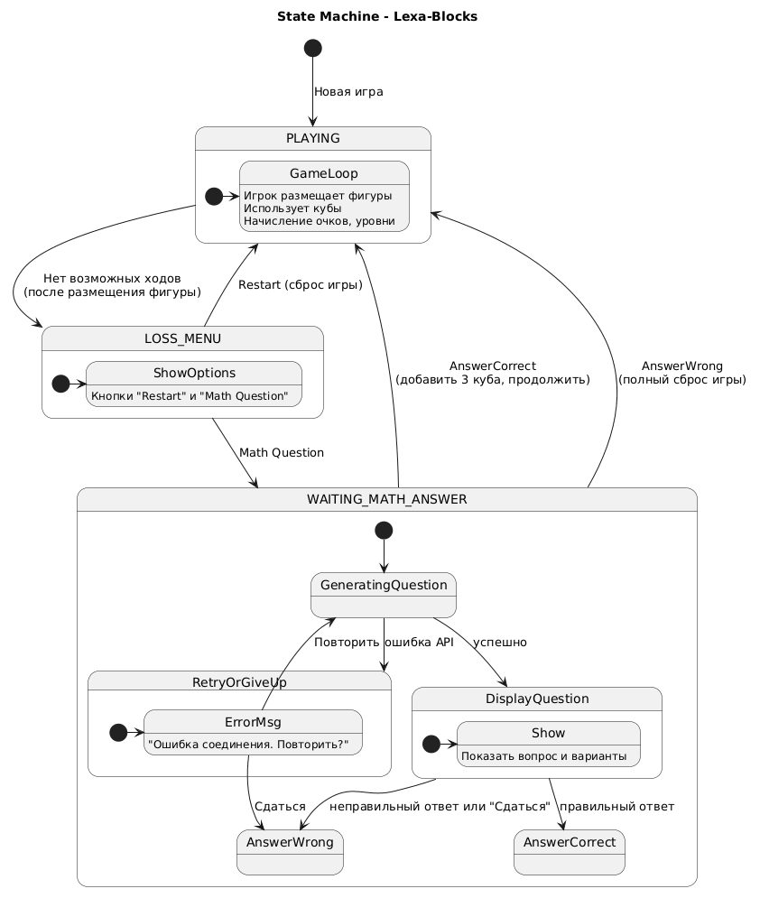

# Текстовое описание диаграммы состояний – Lexa-Blocks

## Общее назначение
Диаграмма описывает все возможные состояния игры Lexa-Blocks и переходы между ними: от обычного игрового процесса через ситуацию «нет ходов» к экрану поражения и затем к блоку с математическим вопросом, который может либо вернуть игру с бонусом, либо полностью сбросить прогресс.

## Начальное состояние
`PLAYING : Новая игра`  
При запуске новой игры система сразу переходит в состояние `PLAYING`.

## Состояние `PLAYING` (игровой процесс)
Внутренняя структура:
- `GameLoop` — вход в игровой цикл.
- `GameLoop` содержит действия:  
  *Игрок размещает фигуры*,  
  *Проверка заполненных линий*,  
  *Начисление очков*.

**Выход из состояния:**  
`PLAYING --> LOSS_MENU` — переход происходит, когда **нет возможных ходов** (после размещения очередной фигуры).

## Состояние `LOSS_MENU` (экран поражения)
Внутренняя структура:
- `Options` — отображаются опции.
- `Options` показывает кнопки **"Restart"** и **"Math Question"**.

**Переходы:**
- `LOSS_MENU --> PLAYING` по действию **Restart** (сброс игры до начального состояния).
- `LOSS_MENU --> WAITING_MATH_ANSWER` по действию **Math Question** (игрок хочет ответить на вопрос, чтобы получить спасательные кубы).

## Состояние `WAITING_MATH_ANSWER` (ожидание ответа на вопрос)
Внутренняя структура с подсостояниями:

1. `DisplayQuestion` — показать математический вопрос (полученный из `EduModule`).
2. `WaitInput` — ожидание ответа от игрока.
   - Из `WaitInput` возможен переход в `AnswerCorrect` (правильный ответ).
   - Из `WaitInput` возможен переход в `AnswerWrong` (неправильный ответ).

**Переходы из `WAITING_MATH_ANSWER` в `PLAYING`:**
- `AnswerCorrect` → добавляется **3 спасательных куба**, игра продолжается.
- `AnswerWrong` → **полный сброс**:
  - очки = 0,
  - поле очищено,
  - количество спасательных кубов = 0.
